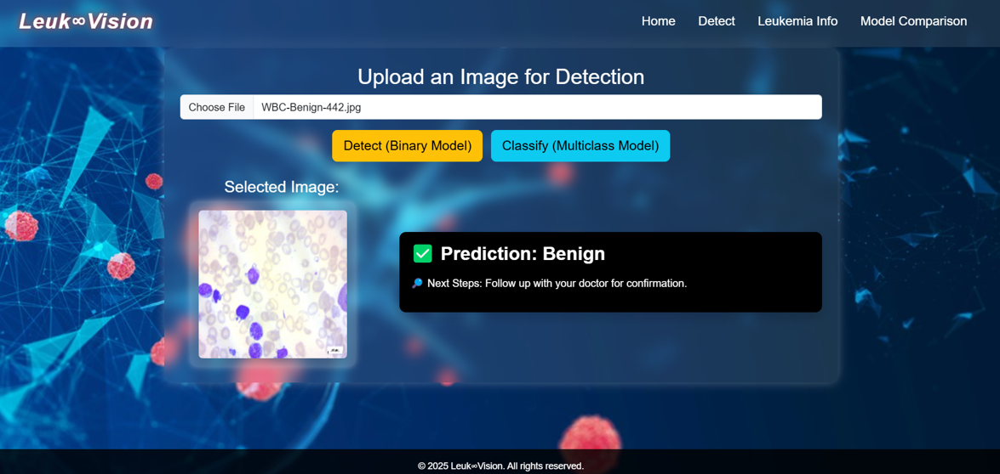

# 🔬 DL-ALL: Acute Lymphoblastic Leukemia Classification

A complete end-to-end deep learning pipeline for detecting and classifying **Acute Lymphoblastic Leukemia (ALL)** from peripheral blood smear images.

---

## 📌 Highlights

- ✅ Reimplementation of the base research paper
- ✅ Novel hybrid model: **LeukVision**
- ✅ Flask-based web app for real-time classification

---

## 1️⃣ Base Paper Reimplementation

**Dataset:** ALL-IDB2  
**Techniques Used:**  
- GLCM (Gray Level Co-occurrence Matrix)  
- LBP (Local Binary Pattern)  
- PCA (Principal Component Analysis)  
- DWT (Discrete Wavelet Transform)  

**Classifiers:**
- SVM  
- Random Forest  
- ResNet50  
- MobileNetV2  

### 📊 Results

| Model         | Accuracy |
|---------------|----------|
| Random Forest | 98.25%   |
| ResNet50      | 93.5%    |
| MobileNetV2   | 90.3%    |

📁 Folder: `base-paper-implementation/`

### 🧠 Base Paper Architecture  


---

## 2️⃣ Novel Implementation – LeukVision

We developed a hybrid fusion model called **LeukVision**, combining:

- 🧠 **ResNet50** (trainable CNN backbone)
- 🔍 **ViT** – Frozen Vision Transformer for global attention
- 💡 **Class-Specific Prompt Embeddings** (128-D)
- 🌊 **Wavelet Features** using Haar DWT (4096-D)

These features are concatenated into a **7032-D** vector and passed through a final dense classifier.

### 📊 Accuracy

| Model               | Accuracy |
|---------------------|----------|
| **LeukVision**       | **100%** |
| MobileNet + XGBoost | 98.25%   |
| ShuffleNet + RF     | 97.75%   |
| VGG16 + SVM         | 93.75%   |

📁 File: `Novelty code.ipynb`

### 🔬 LeukVision Architecture  


---

## 🌐 Web Application

A Flask-based web interface for real-time prediction and classification:

### 🔍 Features:
- Upload a peripheral smear image
- Detect if **ALL** is present (Binary ViT)
- Classify into: **Benign**, **Early**, **Pre**, **Pro**
- Compare predictions across multiple models

📁 Folder: `web_app/`

### 🖼️ Web Interface  


---

## 🛠 How to Run Locally

```bash
# Clone the repository
git clone https://github.com/poojithakappeta/ALL.github.io
cd ALL.github.io/web_app

# Install dependencies
pip install -r requirements.txt

# Run the Flask app
python app.py
